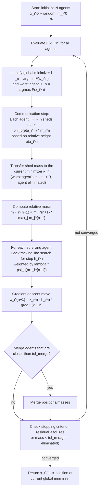

# Swarm-Based Gradient Descent (SBGD): Flow Chart, Algorithmic Framework, and Theory

This document summarizes the algorithm described in `2211.17157v2.pdf` ("Swarm-Based
Gradient Descent Method for Non-Convex Optimization", Lu, Tadmor & Zenginoglu), and
explains — with supporting theory — why combining a population-based (DE-like)
exploration mechanism with local Gradient Descent (GD) succeeds in cases where each
method fails on its own.

## 1. High-level idea

SBGD keeps a swarm of `N` agents. Each agent `i` has:

- a position `x_i` in the search space, updated by a **local gradient-descent step**
  (like classical GD), and
- a mass/weight `m_i` in `(0, 1]`, with `sum_i m_i = 1`, updated by a
  **communication/mass-transfer rule** (conceptually similar to the selection/
  recombination step in Differential Evolution and other population-based
  metaheuristics: information is exchanged across the population instead of each
  candidate solution evolving independently).

Heavier agents are "leaders" — they behave like ordinary GD close to a promising
minimum and take **small, cautious steps**. Lighter agents are "explorers" — they take
**large steps** (backtracking line search with a big initial step) and are more likely
to escape local basins of attraction. Whenever an explorer discovers a lower point,
mass flows toward it and it becomes the new leader. The single worst agent at each
iteration loses all its mass and is eliminated ("survival of the fittest").

## 2. Flow chart



## 3. Algorithmic framework (pseudocode)

```
Input: N (agents), p, q (mass/step tuning), lambda, gamma (backtracking params),
       tol_m, tol_merge, tol_res

Initialize:
    x_1^0, ..., x_N^0  ~ random in the search domain
    m_1^0 = ... = m_N^0 = 1/N
    i-_0 = argmin_i F(x_i^0)

for n = 0, 1, 2, ... do
    F_min = F(x_{i-_n}^n);  F_max = max_i F(x_i^n)

    # --- Communication: mass transition ---
    for each agent i != i-_n:
        eta_i^n = (F(x_i^n) - F_min) / (F_max - F_min + eps)   # relative height
        loss_i  = phi_p(eta_i^n) * m_i^n                       # phi_p(eta) = eta^p
        if m_i^n - loss_i < tol_m:
            m_i^{n+1} = 0                                      # agent eliminated
        else:
            m_i^{n+1} = m_i^n - loss_i
    m_{i-_n}^{n+1} = m_{i-_n}^n + sum(loss_i for i != i-_n)     # total mass conserved

    m_plus = max_i m_i^{n+1}

    # --- Gradient descent with mass-weighted backtracking ---
    for each surviving agent i:
        m~_i^{n+1} = m_i^{n+1} / m_plus                        # relative mass in [0,1]
        h_i^n = BacktrackingLineSearch(x_i^n, lambda * psi_q(m~_i^{n+1}), gamma)
        x_i^{n+1} = x_i^n - h_i^n * grad F(x_i^n)

    merge any agents with |x_i - x_j| < tol_merge

    i-_{n+1} = argmin_i F(x_i^{n+1})
    residual = |x_{i-_{n+1}}^{n+1} - x_{i-_n}^n|
    if residual < tol_res: break

return x_SOL = x_{i-_n}^n


function BacktrackingLineSearch(x, lambda_eff, gamma):
    h = h0                      # large initial step
    while F(x - h * grad F(x)) > F(x) - lambda_eff * h * |grad F(x)|^2:
        h = gamma * h           # shrink step
    return h
```

Default "vanilla" parameters: `p = q = 1`, `phi_p(eta) = eta^p`, `psi_q(m~) = m~^q`.
The paper reports `(p, q) = (2, 1)` or `(2, 1/2)` often performs slightly better.

## 4. Why communication helps: theory of effectiveness

The key theoretical/empirical result is that **plain GD (or a population of
non-communicating GD/backtracking agents) and pure population-based search
(e.g., DE-style exploration without any local descent) each fail in complementary
ways**, while SBGD's communication mechanism combines their strengths.

### 4.1 Where Gradient Descent alone fails

Classical GD follows `x^{n+1} = x^n - h * grad F(x^n)`. Its descent direction is
purely local: once trapped in the basin of attraction of a local minimum it has *no
mechanism to escape*, regardless of how many independent restarts (agents) are used,
because each agent behaves identically and independently. The paper's numerical
experiments (Table 2.2, Table 6.3, Table 7.1–7.2) show that when the initial
population does not "enclose" the global minimum, non-communicating GD/backtracking
(`GD(BT)`) success rates collapse toward 0%, no matter how large `N` is — e.g., for
the shifted 1D Ackley function with `B = 25`, `GD(BT)` scores 0% at `N = 10, 20, 30`
while SBGD scores 45–99%.

### 4.2 Where pure population/DE-style search alone is weak

A population-based method without a strong local descent rule (e.g., relying only on
mutation/recombination like DE, or the diffusion term in Consensus-Based Optimization)
converges slowly near the minimum and is comparatively expensive because it needs many
function evaluations to refine the final position — it lacks a local convergence-rate
guarantee. The paper notes the related Consensus-Based Optimization method is
"sensitive to the application of the alpha-weighted Laplace principle" and to its
diffusion parameters (Section 2.2), because it never uses gradient information.

### 4.3 Why SBGD (GD + swarm communication) succeeds

SBGD's descent bound (Lemma 5.1 in the paper) shows each agent's step secures:

```
F(x_i^{n+1}) <= F(x_i^n) - (2*gamma/L) * (1 - lambda*m~_i^{n+1}) * lambda*m~_i^{n+1} * |grad F(x_i^n)|^2
```

This bound depends on the *relative mass* `m~_i^{n+1}` rather than requiring a small,
conservative step size. Two consequences give SBGD its combined advantage:

1. **Global exploration (DE-like benefit):** light agents (small `m~_i`) are permitted
   large backtracking step sizes, letting them search regions far from the initial
   swarm — exactly the "population diversity" mechanism that lets DE/genetic
   algorithms escape a bad initial guess, but here still directed by the local
   gradient instead of blind mutation.
2. **Local convergence (GD benefit):** once an agent's mass grows (because it found a
   lower point and other agents transferred mass to it), `m~_i -> 1` and the step size
   is tamed, giving the same local convergence guarantee as backtracking GD
   (Theorem 5.4: the sequence of SBGD minimizers converges to a band of equal-height
   local minima, with a polynomial or exponential rate depending on the Lojasiewicz
   flatness exponent, Theorem 5.6).

Because mass dynamically reallocates from high agents to the current best, SBGD
behaves like a *feedback loop* between exploration and exploitation: explorers
(DE-like global search) hand off responsibility to leaders (GD-like local refinement)
whenever they find a better point. This explains the empirical results (Tables
2.1–2.2, 6.2–6.3, 7.1–7.3): SBGD matches non-communicating GD/DE-style methods when
the global optimum is already inside the initial population, and **substantially
outperforms both when it is not**, since neither GD alone (no exploration) nor a
purely derivative-free population method alone (slow local refinement) can efficiently
recover in that scenario.

## 5. Reference

Lu, J., Tadmor, E., & Zenginoglu, A. "Swarm-Based Gradient Descent Method for
Non-Convex Optimization." arXiv:2211.17157v2 [math.NA] (2024). See the full PDF in
this repository: `2211.17157v2.pdf`.
